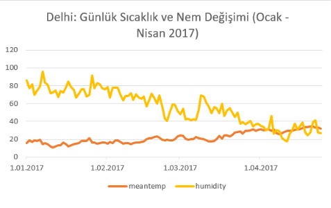
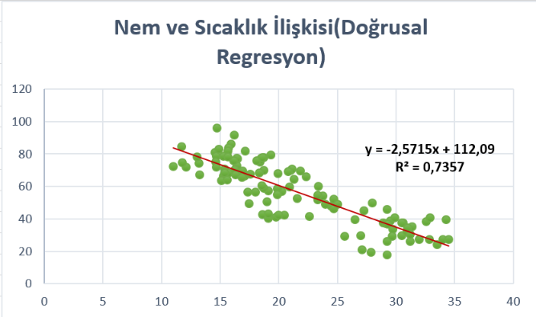

# delhi-climate-analysis
Delhi hava durumu verisi üzerinde yapılan veri analizi çalışması
# Delhi Hava Durumu Analizi ve Veri Temizleme (Delhi Climate Analysis)

Bu proje, 1 Ocak 2017 – 24 Nisan 2017 tarihleri arasında Delhi şehrine ait günlük hava durumu parametrelerinin incelenmesi, veri kalitesi kontrolü ve veri temizleme adımlarını içermektedir.

## Veri Seti Hakkında
- **date:** Gözlem tarihi (Günlük)
- **meantemp:** Ortalama sıcaklık (°C)
- **humidity:** Nem oranı (%)
- **wind_speed:** Rüzgar hızı (km/s)
- **meanpressure:** Ortalama atmosfer basıncı (hPa)

## Yapılan Veri Temizleme ve Kalite Adımları
1. **Veri Türü ve Ayraç Düzenlemesi:** Ham CSV verisindeki ondalık ayracı uyumsuzlukları giderilerek sayısal ve tarih alanları analize uygun formata getirildi.
2. **Eksik Değer Kontrolü:** Veri setinde boş (missing/NaN) gözlem bulunmadığı doğrulandı.
3. **Uç Değer (Aykırılık) Tespiti ve Düzeltilmesi:** 
   - Atmosfer basıncı sütununda yer alan ve fiziksel olarak yeryüzünde mümkün olmayan `59.0 hPa` ölçüm hatası tespit edildi.
   - Bu aykırı değer, zaman serisi mantığına uygun olarak ertesi günün gerçekçi basınç seviyesi (`1018.28 hPa`) ile güncellendi.
4. **Mantıksal Aralık Doğrulaması:** Nem oranlarının %0-100 aralığında olduğu, rüzgar hızı ve sıcaklık dağılımlarının Delhi'nin kış/ilkbahar iklim normlarıyla tutarlı olduğu doğrulandı.

## Gelecek Adımlar
- Değişkenler arası korelasyon analizi ve grafiksel görselleştirmeler (EDA).
- Sıcaklık tahmini üzerine regresyon ve zaman serisi modellemeleri.
## 1.Keşifçi Veri Analizi (EDA) ve Görselleştirme

Aşağıdaki grafikte Ocak 2017 ile Nisan 2017 arasındaki sıcaklık ve nem değişimi incelenmiştir:

### Temel Çıkarımlar
- **Zıt Yönlü Trend:** Delhi'de kıştan ilkbahara geçiş sürecinde sıcaklık ortalama 11°C seviyelerinden 34.5°C seviyelerine yükselirken, nem oranı belirgin bir düşüş göstermiştir.
- **Korelasyon Analizi:** Ortalama sıcaklık ile nem oranı arasında **r = -0.86** seviyesinde güçlü ve negatif yönlü bir ilişki tespit edilmiştir (p < 0.001).
## 2. Doğrusal Regresyon Modellemesi
Sıcaklık artışının nem üzerindeki marjinal etkisini ölçmek amacıyla En Küçük Kareler (OLS) yöntemiyle doğrusal regresyon modeli kurulmuştur:

### Model Özeti ve Katsayılar
- **Model Eşitliği:**  
  $$\text{Nem} = -2.5715 \times \text{Sıcaklık} + 112.09$$
- **Belirleme Katsayısı ($R^2$):** **0.7357**  
  Nem oranındaki varyansın **%73.6'sı** sıcaklık değişkeni tarafından açıklanmaktadır.
- **Eğim Yorumu:** Ortalama sıcaklıktaki her 1°C'lik artış, nem oranında ortalama **2.57 puanlık** bir düşüşe yol açmaktadır.
